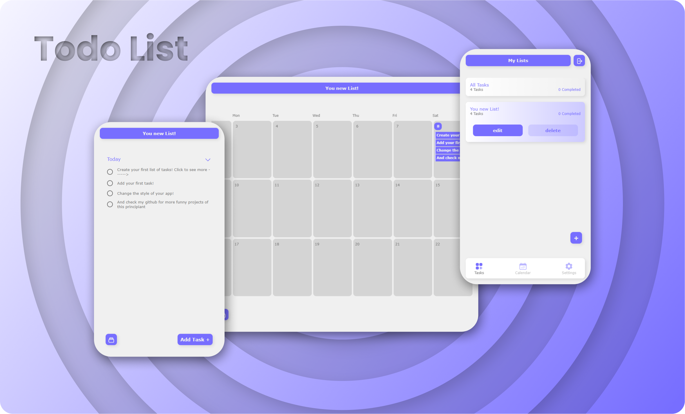
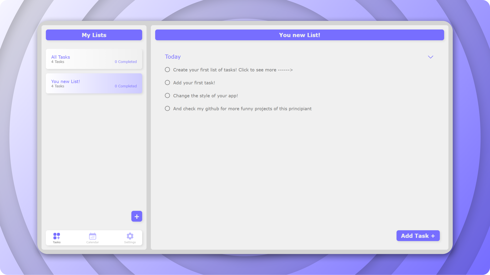

#

<h1 align="center">Todo list React Version</h1>

  Todo list for <a href="https://www.theodinproject.com/">The Odin Project</a> 
  (this version presents some changes, it is possible that the image is not 100% accurate.)

## Demo

👁️ [Live Demo](https://apheiro.github.io/todo_list/)

## Built with

- JavaScript
- Css
- Webpack
- [framer motion](https://www.framer.com/motion/)
- [full calendar](https://fullcalendar.io/)
- [auto-animate](https://github.com/formkit/auto-animate)
- [uniq-id](https://www.npmjs.com/package/uniqid)
- [react-icons](https://react-icons.github.io/react-icons/)
- [date-fns](https://github.com/date-fns/date-fns)

## Features

- Dinamic HTML
- Responsive design.
- Clean desing
- _Smooth_ animations.
- Different styles.

## Screenshots

